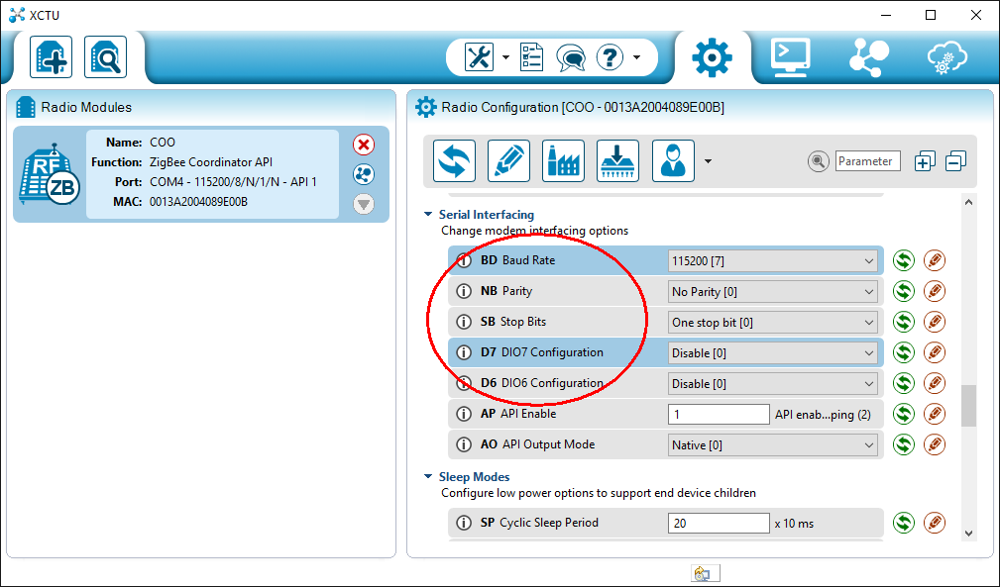
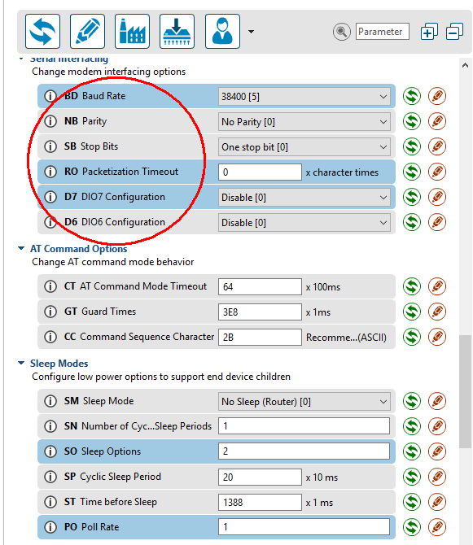
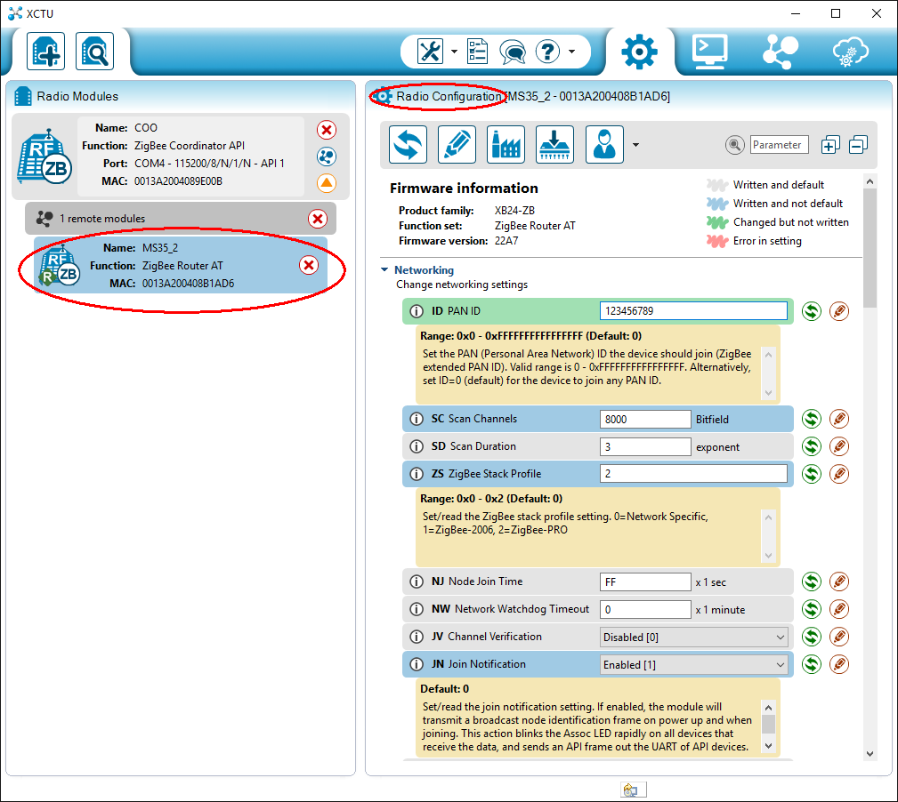
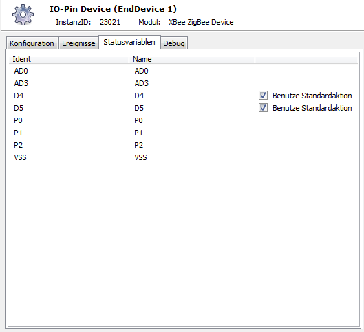

# IPSXBeeZigBee

Implementierung der XBee-ZigBee Serie2.

## Dokumentation

**Inhaltsverzeichnis**

1. [Funktionsumfang](#1-funktionsumfang) 
2. [Voraussetzungen](#2-voraussetzungen)
3. [Software-Installation](#3-software--installation)
4. [Hardware-Installation](#4-hardware--installation)
5. [Einrichten der Gateway & Splitter Instanzen in IPS](#5-einrichten-der-gateway--splitter-instanzen-in-ips)
6. [Einrichten der Analog / Digital IOs in IPS](#6-einrichten-der-analog--digital-ios-in-ips)
7. [PHP-Befehlsreferenz](#7-php-befehlsreferenz) 
8. [Parameter / Modul-Infos](#8-parameter--modul-infos) 
9. [Tips & Tricks](#9-tips--tricks) 
10. [Anhang](#10-anhang)

## 1. Funktionsumfang

 Bereitstellen und Abbilden der Schnittstellen und A/D-PIN-IOs eines XBee-ZigBee Netzwerkes. Implementierung des ZigBee API-Protokoll der XBee Serie2.  
 Senden und Empfang von seriellen Daten eines Gerätes, welches an einem entfernten XBee Router bzw. EndDevice angeschlossen ist.  
 Empfangen von PIN-IO-Samples.  
 Lesen und schreiben von Parametern aller im ZigBee-Netzwerk vorhandenen Geräte (inkl. Coordinator).  
 
 Die serielle Schnittstellen der Router / EndDevices werden in IPS als Splitter abgebildet und sind direkt in IPS als übergeordnete Instanz für alle Geräte verfügbar, welche sonst eine Serielle Schnittstelle benötigen (oder eine andere IO-Instanz benötigen welches SendString unterstützt.).  
     

## 2. Voraussetzungen

 - IPS ab Version 3.1 oder IPS Version 4.x
 - min. zwei XBee-Serie2 (ZigBee)
 - Konfigurationssoftware X-CTU (www.digi.com)
 - RS232 / auf 3,3V Adapter (-Platine) oder USB-Seriell-Wandler mit 3,3V für den Coordinator (oder jede andere Form der seriellen Datenanbindung mit 3,3V)

 
## 3. Software-Installation

**IPS 3.1 bis 3.4:**  
   Bei GitHub das gepackte Modul als ZIP-File laden: [XBEE_ZB.ZIP](https://github.com/Nall-chan/IPSXBeeZigBee/raw/master/IPS3.X/XBEE_ZB.zip)  
   Die enthaltende Datei MS35.dll in das /modules Verzeichnis von IPS kopieren.  
   Ist der Ordner Modules nicht vorhanden, so ist er anzulegen.  
   IPS-Dienst neustarten.

**IPS 4.x:**  
   Über das Modul-Control folgende URL hinzufügen.  
   `git://github.com/Nall-chan/IPSXBeeZigBee.git`  


## 4. Hardware-Installation

  Installieren der Software XTCU von Digi um die Geräte einzurichten zu können.  
  Auf einen XBee die Firmware des Coordinator laden und Parametrieren von mindestens folgenden Parameter (Der Rest kann auf den Defaultwerten bleiben) :  
     

  - ID	(PAN ID)                :   eigene beliebige PAN ID eintragen
  - ZS	(ZigBee Stack Profile)  :   0x2

     

 Eventuell die Einstellungen der seriellen Schnittstelle anpassen auf die örtlichen Gegebenheiten.

  - BD	(Baud Rate) :   je nach Bedarf (ist nur für die IPS-Einrichtung relevant, nicht für die Endgeräte)
  - NB	(Parity)    :   0x0 (default)
  - SB	(Stop Bits) :   0x0 (default)
  - D7	(DIO7)      :   0x0 (disable)
  - D6	(DIO6)      :   0x0 (disable)
     

 Auf den/die anderen XBee wird eine Router AT / EndDevice AT Firmware aufgespielt.  
 Details zur Verwendungen von Routern und EndDevices sind auf der Herstellerwebseite nach zu lesen.  
 Als grobe Orientierung: Bei großen Strecken zwischen EndDevice und Coordinator einen Router dazwischen einsetzen. Bei Endgeräten welche stromsparend aufgebaut werden müssen, immer ein EndDevice einsetzen.  
     

 Parametrieren von mindestens folgenden Parameter:  

  - ID	(PAN ID)                :   eigene beliebige PAN ID aus dem Coordinator
  - ZS	(ZigBee Stack Profile)  :   0x2
  - JN	(Join Notification)     :   0x1 (Enabled)
     
  - NI	(Node Identifier)       :   Name des Node für die Identifizierung in IPS
     
  - BD	(Baud Rate)             :   je nach Bedarf des jeweiligen Endgerätes an dem XBee (muss nicht identisch sein mit dem Coordinator)
  - NB	(Parity)                :   je nach Bedarf des jeweiligen Endgerätes
  - SB	(Stop Bits)             :   je nach Bedarf des jeweiligen Endgerätes
  - RO  (Packetization Timeout) :   0x0
  - D7	(DIO7)                  :   je nach Bedarf des jeweiligen Endgerätes
  - D6	(DIO6)                  :   je nach Bedarf des jeweiligen Endgerätes
     

 Sind alle Geräte konfiguriert, so kann in XCTU die funktion des Netzwerkes überprüft werden.  
 Hierzu den sich mit den Coordinator per seriellen Anschluß verbinden und eine Netzwerksuche starten.  
 Die EndDevices bzw. Router werden dann gesucht und können zum konfigurieren hinzugefügt werden.  
     
 Somit ist auch eine (spätere) Remote-Konfiguration der Module möglich, ohne diese wieder auszubauen und direkt per seriellen Anschluß zu parametrieren.  
     

## 5. Einrichten der Gateway & Splitter Instanzen in IPS

Unter Instanz hinzufügen (Splitter) wählen und ein XBee ZigBee Splitter hinzufügen (Haken bei Alle Module anzeigen!).
Es wird automatisch ein XBee ZigBee Gateway und ein SerialPort angelegt.
Zuerst den SerialPort Konfigurieren , dabei die Eingestellten Parameter (Baudrate) des Coordinator eintragen. Defaultwert ist 9600. In der Splitter Instanz den Node-ID des entfernten XBee eintragen. Sind diese Parameter eingestellt und übernommen, kann im Debug-Fenster der Gateway-Instanz das Debuging aktivieren werden. Wird jetzt im Testcenter der Instanz (unter Einstellungen) ein Node Discovery ausgelöst, sollten die entfernten XBee im Debug entsprechende Ausgaben erzeugen.
(AT_Command_Responde(ND) : <NI>  <Adresse> <HW-Adresse>)
     

Nun kann mit dem anlegen eigener Instanzen an den XBee-ZigBee Splitter fortgefahren werden.  
Hier ist der jeweilige NI (Node Identifier) einzutragen.


## 6. Einrichten der Analog / Digital IOs in IPS

 Hinweise zur Einrichtung der IOs mit XTCU:  
 Zuerst den Modus aller IO-Pins festlegen. Dabei gibt es außer Spezialfunktionen einiger Pins auch welche die Analogwerte erfassen können (D0 bis D3 = AD0 bis AD3). Die Standardfunktionen Digital Input, Digital Out (Low) und Digital Out (High) stehen an allen Pins zur Verfügung.  
 Die Bitfelder für Change Detection (IC) und Pull-Up Resitor (PR) unterscheiden sich!  
 Bei IC gilt folgende Reihenfolge:  
 Bit (IO Pin):  

 0 (DIO0) 4 (DIO4)   8 (DIO8)  
 1 (DIO1) 5 (DIO5)   9 (DIO9)  
 2 (DIO2) 6 (DIO6) 10 (DIO10)  
 3 (DIO3) 7 (DIO7) 11 (DIO11)  

 Bei PR gilt folgende Reihenfolge:  
 Bit - IO (Pin):  

 0 - DIO4 (Pin 11)  
 1 - AD3 / DIO3 (Pin 17)  
 2 - AD2 / DIO2 (Pin 18)  
 3 - AD1 / DIO1 (Pin 19)  
 4 - AD0 / DIO0 (Pin 20)  
 5 - RTS / DIO6 (Pin 16)  
 6 - DTR / Sleep Request / DIO8 (Pin 9)  
 7 - DIN / Config (Pin 3)  
 8 - Associate / DIO5 (Pin 15)  
 9 - On/Sleep / DIO9 (Pin 13)  
 10 - DIO12 (Pin 4)  
 11 - PWM0 / RSSI / DIO10 (Pin 6)  
 12 - PWM1 / DIO11 (Pin 7)  

 Die Screenshots zeigen einige Beispiele der Einrichtung in IPS. Es ist zu beachten das Änderungen der Konfiguration der Pins erst bei IPS-Neustart, durch den Befehl XBEE_ReadConfig oder dem Button ReadConfig in der Testumgebung, in IPS übernommen werden.  
 Es werden nur PINs als Statusvariablen angelegt, welche als Ein- oder Ausgang im XBee parametriert sind.  
 Alle aus Ausgang konfigurierten Pins erhalten das Standardprofil ~Switch sowie eine dazugehörige Standardaktion, wodurch die Ausgänge direkt im WebFront schaltbar sind.  
 Bei bedarf kann diese Funktion unter Statusvariablen, durch entfernen des Haken 'Benutze Standardaktion', deaktiviert werden.  
 Die Werte der Analogeingänge wird als Integer dargestellt, welche dem vom XBEE gelieferten Wert entspricht (max. Eingangsspannung von 1,2V beachten!).  
 Der Wert VSS entspricht der vom XBEE übermittelten Wert der Versorgungsspannung.  
 Hierzu kann es notwendig sein den Parameter V+ im XBEE zu konfigurieren.  
     
     
     
     

## 7. PHP-Befehlsreferenz

 **XBee-ZB Gateway:**  
```php
XBEE_NodeDiscovery(integer $InstanzeID);
```
 Sendet einen NodeDiscovery in das ZigBee-Netzwerks.  

---

 **XBee-ZB Splitter:**  
 (Keine PHP Funktionen)

---

 **XBee-ZB Device:**  

```php
boolean XBEE_RequestState(integer $InstanzeID);
```
Ließt den Status der IOs. Konnte der Befehl erfolgreich ausgeführt werden, liefert er als Ergebnis TRUE, andernfalls FALSE.  

---

```php
boolean XBEE_ReadConfig(integer $InstanzeID);
```
Ließt die Konfiguration der IOs. Konnte der Befehl erfolgreich ausgeführt werden, liefert er als Ergebnis TRUE, andernfalls FALSE.   

---

```php
boolean XBEE_WriteBoolean(integer $InstanzeID, string $Pin, boolean $Value);
```
Digitalen Ausgang ansteuern. Pin ist der Name des IOs aus XTCU, welcher auch dem Ident der Statusvariable entspricht. Konnte der Befehl erfolgreich ausgeführt werden, liefert er als Ergebnis TRUE, andernfalls FALSE.  
Beispiel:  
```php
XBEE_WriteBoolean(123456, 'D4', true);  // Setzt Ausgage D4
```

---
  
```php
boolean XBEE_WriteParameter(integer $InstanzeID, string $Parameter, string $Value);
```
Schreibt den Inhalt von Value (=RAW-String) in den Parameter. Konnte der Befehl erfolgreich ausgeführt werden, liefert er als Ergebnis TRUE, andernfalls FALSE.  
Beispiele:  
```php
XBEE_WriteParameter(123456, 'NI', 'MS35_5');  // Setzt den NodeIdent auf MS35_5
XBEE_WriteParameter(123456, 'IR', chr(0x27).chr(0x10));  // Legt 10 sek. als Intervall für das periodische Sampling des Node fest.
```

---

```php
string XBEE_ReadParameter(integer $InstanzeID, string $Parameter);
```
Ließt einen Parameter und gibt ihn als RAW-String zurück. Konnte der Befehl nicht erfolgreich ausgeführt werden, liefert er als Ergebnis FALSE.  
Beispiel:  
```php
echo XBEE_ReadParameter(123456, 'NI');  // Gibt den NodeIdent aus (z.B. MS35_5)
```

## 8. Parameter / Modul-Infos

GUIDs der Instanzen (z.B. wenn Instanz per PHP angelegt werden soll):  

| Instanz  | GUID                                   |
| :------: | :------------------------------------: |
| Gateway  | {B92E4FAA-1754-4FDC-8F7F-957C65A7ABB8} |
| Splitter | {61051B08-5B92-472B-AFB2-6D971D9B99EE} |
| Device   | {68468B6F-DC2B-4A04-83A5-DA072651E4B5} |

Eigenschaften des Gateways für Get/SetProperty-Befehle:  

| Eigenschaft | Typ     | Standardwert | Funktion                            |
| :---------: | :-----: | :----------: | :---------------------------------: |
| NDInterval  | integer | 60           | Zyklischer Node Discovery (0 = aus) |

Eigenschaften des Splitters für Get/SetProperty-Befehle:  

| Eigenschaft | Typ    | Standardwert | Funktion                 |
| :---------: | :----: | :----------: | :----------------------: |
| NodeName    | string |              | Node Identifier des XBee |

Eigenschaften des Devices für Get/SetProperty-Befehle:  

| Eigenschaft   | Typ     | Standardwert | Funktion                                                           |
| :-----------: | :-----: | :----------: | :----------------------------------------------------------------: |
| Interval      | integer | 0            | Zeit in sek. für zyklische Pin abfrage                             |
| EmulateStatus | boolean | false        | Beim schalten eines PIN wird die Statusvariable sofort nachgeführt |

## 9. Tips & Tricks

- Zuerst ein funktionierendes ZigBee Netzwerk mit XTCU und den XBees aufbauen.
- Bei Übertragungsproblemen die Slepp-Einstellungen der EndDevices kontrollieren und anpassen (SM,SP,ST,SN,SO,PO). Oder das Gerät ohne Sleep betreiben.
- Baudraten der Geräte einstellen. (getestet bis 11500)
- Bei eigenen Scripten hinter einer XBee-Splitter Instanz, ab besten eine Cutter zwischen Splitter und RegVar schalten, wenn die empfangenen Nutzdaten mehr als 66 Byte pro Paket   beinhalten. Da oberhalb dieser Grenze die Nutzdaten fragmentiert übertragen werden. (Alternativ zum Cutter können auch im Script die Nutzdaten wieder  defragmentiert werden.)
- Unterhalb von jedem Parameter im XTCU kann eine Hilfe aufgeklappt werden.
- Folgende Reihenfolge hilft beim einrichten des Pin-IO-Sampling: Typ der jeweiligen Pins festlegen; Pull-Up-Widerstände der Eingänge konfigurieren; ChangeDetection 'IC' festlegen für Pins bei welchen eine Änderung sofort übertragen wird (erspart das pullen seitens IPS und es braucht auch der Haken Status emulieren nicht gesetzt werden). Bei Analog-Eingängen einen Sample-Intervall 'RI' festlegen, da ChangeDetection hier nicht funktioniert.
- Die Pins des Coordinator können nicht per SI oder IC automatisch ihren Status mitteilen. Hier ist zwingend in der IPS-Instanz 'XBee-ZigBee Device' ein Intervall einzustellen.
- Die Debug Ausgaben der einzelnen Instanzen helfen bei der Fehlersuche. Enthalten sind u.a. die Datenpakete, Statusinformationen und eventuelle Fehlermeldungen.
- Die Baudraten der Geräte können alle unterschiedlich sein !
- Die Baudrate des Coordinator sollte mindestens der höchsten Baudrate der EndDevices/Routers betragen.
- XBEE_WriteParameter &  XBEE_ReadParameter arbeiten mit RAW-Daten. Es ist somit nötig die Daten in das korrekte Format zu bekommen.  

Das funktioniert z.B. nicht korrekt:  
```php
XBEE_WriteParameter(123456,'IR',10000) // Sample-Intervall 10Sek.
XBEE_WriteParameter(123456,'IR',0x2710) // Sample-Intervall 10Sek.
```

So funktioniert es wie gewünscht:  
```php
XBEE_WriteParameter(123456,'IR',chr(0x27).chr(0x10)) // Sample-Intervall 10Sek.
// oder
XBEE_WriteParameter(123456,'IR',pack("n",10000)) // Sample-Intervall 10Sek.
```

## 10. Anhang

**Changlog:**

1.0.	:  Erstes öffentliches Release für IPS 3.1
2.0     :  Erstes öffentliches Release für IPS 4
